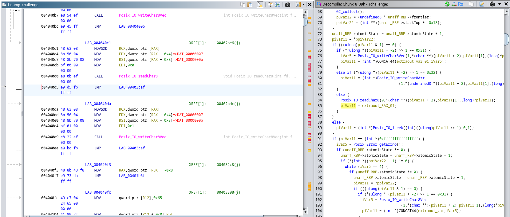

# vikeCTF 2024
## Reverse - Cursed
```
Good luck
```
All we are given for this challenge is a binary `challenge` attachment.
When executed, it prompts the user to input the flag, prints whether the input is correct or not, and exits.
The file appears to be unstripped:
```
$ file ./challenge
challenge: ELF 64-bit LSB executable, x86-64, version 1 (GNU/Linux), statically linked, BuildID[sha1]=f6b8b2d81909fb8e6da702e6a1c056c4dc3409bb, for GNU/Linux 4.4.0, not stripped
```
Let's throw it in Ghidra!

### Initial static analysis in Ghidra
We can immediately identify a number of references to `MLTon`. A quick search reveals that `MLTon` is a "whole-program optimizing compiler for the Standard ML programming language.". It appears that this challenge has been written in Standard ML and compiled to a binary using MLTon. The binary doesn't seem to make use of any particular anti-debugging or obfuscation technique; however, there are not a ton of resources related to MLTon reverse engineering.


After a bit of static analysis, we can determine that at a high level, the programme appears to be based on the looped execution of a succession of code chunks, each of which returns the index of the chunk to be executed next (see: MLTon [c-main.h](https://github.com/MLton/mlton/blob/2637b22ccdd9cd1268b6b46ff6107066bf8c8888/include/c-main.h#L66)). Chunk_8, in particular, appears to aggregate a number of sub-chunks reached via a jumptable. We could continue with the static analysis of the code, but given the large number of instructions to be analysed and the annoying behaviour of constantly jumping between chunks, this would be a long and (needlessly) tedious task. Instead, we will proceed with a mixture of gdb debugging and analysis of the executed instructions and accessed memory locations, cross-referencing the interesting bits with the disassembled code.

### Initial dynamic analysis
Let's begin by having a look at strace output on the program:
<details><summary>strace output</summary><p>

```
$ strace -i ./challenge
[000067491e14023b] execve("./challenge", ["./challenge"], 0x7d5eb5848448 /* 105 vars */) = 0
[0000000000418c85] arch_prctl(0x3001 /* ARCH_??? */, 0x7878b34833e0) = -1 EINVAL (Invalid argument)
[000000000044dbfb] brk(NULL)            = 0x31880008
[000000000044dc06] brk(0x31880d08)      = 0x31880d08
[0000000000419986] arch_prctl(ARCH_SET_FS, 0x318803c0) = 0
[000000000044d22e] set_tid_address(0x31880690) = 12866
[000000000044d28a] set_robust_list(0x318806a0, 24) = 0
[000000000044d2fe] rseq(0x31880ce0, 0x20, 0, 0x53053053) = 0
[000000000044b074] prlimit64(0, RLIMIT_STACK, NULL, {rlim_cur=8192*1024, rlim_max=RLIM64_INFINITY}) = 0
[0000000000482203] readlinkat(AT_FDCWD, "/proc/self/exe", "/home/rw/CTFs/vik"..., 4096) = 53
[000000000042cb05] getrandom("\x3a\x48\xf1\x19\x07\xec\xa9\xe5", 8, GRND_NONBLOCK) = 8
[000000000044b0db] brk(NULL)            = 0x31880d08
[000000000044b0db] brk(0x318a1d08)      = 0x318a1d08
[000000000044b0db] brk(0x318a2000)      = 0x318a2000
[000000000044b92b] mprotect(0x4c7000, 28672, PROT_READ) = 0
[000000000044be1b] sysinfo({uptime=11555, loads=[11808, 25728, 31456], totalram=16048922624, freeram=3729805312, sharedram=419254272, bufferram=318631936, totalswap=0, freeswap=0, procs=2176, totalhigh=0, freehigh=0, mem_unit=1}) = 0
[000000000044b896] mmap(NULL, 24576, PROT_READ|PROT_WRITE, MAP_PRIVATE|MAP_ANONYMOUS, -1, 0) = 0x6b6a59ecf000
[000000000044b92b] mprotect(0x6b6a59ecf000, 4096, PROT_NONE) = 0
[000000000044b92b] mprotect(0x6b6a59ed0000, 16384, PROT_READ|PROT_WRITE) = 0
[000000000044b92b] mprotect(0x6b6a59ed4000, 4096, PROT_NONE) = 0
[0000000000419d8b] sigaltstack({ss_sp=0x6b6a59ed2000, ss_flags=0, ss_size=8192}, NULL) = 0
[000000000044b896] mmap(0xf80000000000, 98304, PROT_READ|PROT_WRITE, MAP_PRIVATE|MAP_ANONYMOUS, -1, 0) = 0x6b6a59eb7000
[000000000044af9a] ioctl(1, TCGETS, {c_iflag=ICRNL|IXON|IXOFF|IUTF8, c_oflag=NL0|CR0|TAB0|BS0|VT0|FF0|OPOST|ONLCR, c_cflag=B38400|CS8|CREAD, c_lflag=ISIG|ICANON|ECHO|ECHOE|ECHOK|IEXTEN|ECHOCTL|ECHOKE, ...}) = 0
[000000000044a94e] newfstatat(1, "", {st_mode=S_IFCHR|0600, st_rdev=makedev(0x88, 0x3), ...}, AT_EMPTY_PATH) = 0
[000000000044a94e] newfstatat(0, "", {st_mode=S_IFCHR|0600, st_rdev=makedev(0x88, 0x3), ...}, AT_EMPTY_PATH) = 0
[000000000044a94e] newfstatat(0, "", {st_mode=S_IFCHR|0600, st_rdev=makedev(0x88, 0x3), ...}, AT_EMPTY_PATH) = 0
[000000000044ac64] write(1, "Enter flag: ", 12Enter flag: ) = 12
[000000000044ab61] read(0, vikeCTF{AAAAAAAAAA}
"vikeCTF{AAAAAAAAAA}\n", 4096) = 20
[000000000044ac64] write(1, "Wrong!\n", 7Wrong!
) = 7
[000000000044a724] close(0)             = 0
[000000000044b95b] munmap(0x6b6a59eb7000, 98304) = 0
[00000000004495ed] exit_group(0)        = ?
[????????????????] +++ exited with 0 +++
```
</p></details>

The mmap invocations look interesting; by setting a breakpoint and looking at the backtrace in GDB, cross-referencing the calls with MLTon source, we can figure out that the [first call](https://github.com/MLton/mlton/blob/2637b22ccdd9cd1268b6b46ff6107066bf8c8888/runtime/gc/signals.c#L27) is setting up an anonymous stack to receive signals, while the [second one](https://github.com/MLton/mlton/blob/2637b22ccdd9cd1268b6b46ff6107066bf8c8888/runtime/gc/heap.c#L251) is allocating a heap.
In the same way we can also figure out the point in the program where the flag is initially being read (0x4040d5/Chunk_8+0x2587) and the point in the program where the flag correctness verdict is eventually printed on screen (0x4040ee/Chunk_8+0x25a0). They both appear to be part of a generic I/O-related sub-chunk somewhere within Chunk_8; if we take a look at the corresponding disassembled code, it doesn't tell us much about the flag:



Either way, any decision about the correctness of the flag must be taking place in whatever is executed between these two. There are multiple ways to determine what's happening before the last bit of printing-related code through dynamic analysis, including gdb's record feature, rr, and Qiling. We chose to proceed with the latter, as its simple scripting and in-depth monitoring (executed instructions/syscalls, memory writes/reads, ...) capabilities are likely to also come in handy later in the challenge.

### Executing the binary in Qiling
The file is statically linked, so all we need is a simple rootfs directory containing just the challenge executable:
```
$ find rootfs
rootfs
rootfs/challenge
```
We can now try to initially run the binary in Qiling using qltool. Unfortunately, we are soon met with the following error:
```
$ qltool run --filename rootfs/challenge --rootfs rootfs
...
[=]     mmap(addr = 0xf80000000000, length = 0x18000, prot = 0x3, flags = 0x22, fd = 0xffffffff, pgoffset = 0x0) = 0xf80000000000
[=]     ioctl(fd = 0x1, cmd = 0x5401, arg = 0x80000000dc40) = 0x0
[=]     newfstatat(dirfd = 0x1, path = 0x49b20c, buf_ptr = 0x4d0800, flags = 0x1000) = -0x1 (EPERM)
unhandled exception: [=]        write(fd = 0x2, buf = 0x4c8b48, count = 0x15) = 0x15
SysErr[=]       write(fd = 0x2, buf = 0x4c8cb0, count = 0x6) = 0x6

[=]     write(fd = 0x2, buf = 0x4c89b8, count = 0x1) = 0x1
MLton bug: [=]  write(fd = 0x2, buf = 0x499466, count = 0xb) = 0xb
unhandled exception in Basis Library[=]         write(fd = 0x2, buf = 0x4c8cf0, count = 0x24) = 0x24

Please send a bug report to MLton@mlton.org.
[=]     write(fd = 0x2, buf = 0x49d6a8, count = 0x2e) = 0x2e
[=]     exit_group(code = 0x2) = ?

```
When compared with strace output of a normal execution of the binary, it appears that for some reason the newfstatat syscall invocation in Qiling is failing.
After a little bit of digging, we can soon figure out why this is happening; [this](https://github.com/qilingframework/qiling/blob/9a78d186c97d6ff42d7df31155dda2cd9e1a7fe3/qiling/os/posix/syscall/stat.py#L1280) is Qiling's current implementation of the newfstatat syscall:
```python
def ql_syscall_newfstatat(ql: Qiling, dirfd: int, path: int, buf_ptr: int, flags: int):
    dirfd, real_path = transform_path(ql, dirfd, path, flags)

    try:
        buf = pack_stat_struct(ql, Stat(real_path, dirfd))
        ql.mem.write(buf_ptr, buf)

        regreturn = 0
    except:
        regreturn = -1

    return regreturn
```
It translates the internal path/dirfd to a host path/dirfd through `transform_path`, then invokes Stat on the resulting host path/fd pair. [qiling.os.posix.stat.Stat](https://github.com/qilingframework/qiling/blob/9a78d186c97d6ff42d7df31155dda2cd9e1a7fe3/qiling/os/posix/stat.py#L25) is a wrapper around os.stat:
```python
class Stat(StatBase):
    def __init__(self, path, dirfd=None):
        super().__init__(os.stat(path, dir_fd=dirfd))

```
This won't work for file descriptors that do not represent actual files. While not a proper fix, through a bit of monkey-patching we can try to get the executable running in Qiling within a Python script:
```python
from qiling import Qiling
from qiling.const import QL_VERBOSE
from qiling.os.posix.syscall import ql_syscall_fstat, ql_syscall_newfstatat
from qiling.os.posix.const import AT_EMPTY_PATH

def fix_newfstatat(ql: Qiling, dirfd: int, path: int, buf_ptr: int, flags: int):
    if flags & AT_EMPTY_PATH and not ql.os.utils.read_cstring(path):
        return ql_syscall_fstat(ql, dirfd, buf_ptr)
    return ql_syscall_newfstatat(ql, dirfd, path, buf_ptr, flags)

ql = Qiling([r'rootfs/challenge'], r'rootfs', verbose=QL_VERBOSE.DEBUG)
ql.os.set_syscall('newfstatat', fix_newfstatat)
ql.run()
```
When executing the above script we get the following:
<details><summary>Qiling execution log (after fixing newfstatat)</summary><p>

```
$ python run_challenge.py
...
[+]     0x000000000044b894: mmap(addr = 0xf80000000000, length = 0x18000, prot = 0x3, flags = 0x22, fd = 0xffffffff, pgoffset = 0x0) = 0xf80000000000
[+]     0x000000000044af98: ioctl(fd = 0x1, cmd = 0x5401, arg = 0x80000000dc40) = 0x0
[+]     0x000000000044a94c: fix_newfstatat(dirfd = 0x1, path = 0x49b20c, buf_ptr = 0x4d0800, flags = 0x1000) = 0x0
[+]     0x000000000044a94c: fix_newfstatat(dirfd = 0x0, path = 0x49b20c, buf_ptr = 0x4d0800, flags = 0x1000) = 0x0
[+]     0x000000000044a94c: fix_newfstatat(dirfd = 0x0, path = 0x49b20c, buf_ptr = 0x4d0800, flags = 0x1000) = 0x0
[+]     write() CONTENT: b'Enter flag: '
Enter flag: [+]         0x000000000044ac62: write(fd = 0x1, buf = 0xf800000005c8, count = 0xc) = 0xc
vikeCTF{AAAA}
[+]     read() CONTENT: b'vikeCTF{AAAA}\n'
[+]     0x000000000044ab5f: read(fd = 0x0, buf = 0xf800000016b0, length = 0x1000) = 0xe
[+]     write() CONTENT: b'Wrong!\n'
Wrong!
[+]     0x000000000044ac62: write(fd = 0x1, buf = 0x4c8aa0, count = 0x7) = 0x7
[+]     close(0) = 0
[+]     0x000000000044a722: close(fd = 0x0) = 0x0
[+]     0x000000000044b959: munmap(addr = 0xf80000000000, length = 0x18000) = 0x0
...
```
</p></details>
..success!

### Dynamic analysis of the binary
Now that we got the binary to run in Qiling, we can analyze its behaviour after it reads the flag from stdin. If you've never used Qiling before, here's an example script that may be used as a starting point: [qiling-analyze.py](./scripts/qiling-analyze.py); see [docs.qiling.io](docs.qiling.io) for reference.
Through the script we can obtain a ton of information about the behaviour of the program; the key is now in filtering the specific bits we're interested about.

#### Searching for the encrypted flag
We may first try to have a look at the set of accessed program constants; while this is far from the only possibility, it is not unlikely for a processed representation of the flag to be stored in there somewhere. Only a few addresses are accessed between the two locations of our interest:
```
Enter flag: [=]         write(fd = 0x1, buf = 0xf800000005c8, count = 0xc) = 0xc
[=]     read(fd = 0x0, buf = 0xf800000016b0, length = 0x1000) = 0x21
[=]     MEMWR@0x000000004062f6     *0x4ce0e8 <-- 0x0
[=]     MEMWR@0x00000000406300     *0x4ce0d8 <-- '!' = 0x21
[=]     MEMRD@0x00000000406309     *0x4ce0e8 --> 0x0
[=]     MEMRD@0x00000000406313     *0x4ce0d8 --> '!' = 0x21
[=]     MEMWR@0x000000004065e9     *0x4ce0e8 <-- '!' = 0x21
[=]     MEMRD@0x00000000402cb1     *0x4ca240 --> 0x4ca168
[=]     MEMRD@0x00000000402cb5     *0x4ca238 --> 'i' = 0x69
[=]     MEMRD@0x00000000401ed3     *0x4c8a90 --> 0x7
Wrong!
[=]     write(fd = 0x1, buf = 0x4c8aa0, count = 0x7) = 0x7
```
The access to 0x4ca238 looks particularly interesting; if we have a look at the corresponding disassembled code at 0x00000000402cb1, it looks like it's reading and comparing two linked lists, not long before a decision about the correctness of the flag is made. If we extract the set of values in the 0x4ca238 linked list (terminated by a pointer to 0x1), we get:
```
[0x69,0x73,0x84,0x69,0x55,0xa2,0x66,0x8e,0x5a,0x8a,0x9b,0x79,0x90,0xa0,0x68,0x72,0x6b,0x7a,0x56,0x59,0x72,0x71,0x79,0x84,0x67,0x59,0x58,0x58,0x71,0x66,0x72,0x72]
```
The Shannon entropy of this string is suspiciously close to that of English text; however, we were unable to recover its content by means of a simple bytewise sum or xor. Some results did nonetheless look *suspiciously* close to the expected flag. For instance, if we add 0xdb to each byte (or equivalently, subtract 0x25) we get 'DN_D0}Ai5evTk{CMFU14MLT_B433LAMM', which contains only allowed flag characters, and all of the characters appearing in 'vikeCTF{}'.

#### Determining how the input is encrypted
So how's the input being encrypted? Let's try to analyze what happens to our input starting from the read() syscall this time.
It appears that our string is initially stored in heap at 0xf800000016b0.
If we focus on writes to the heap area, we may start to notice a pattern; a significant number of writes come from loops and are of the following form:
```
...
[=]     MEMWR@0x00000000405c40     *0xf800000046e8 <-- '_' = 0x5f
[=]     MEMWR@0x00000000405c48     *0xf800000046f0 <-- 'E' = 0x45
[=]     MEMWR@0x00000000405c4d     *0xf800000046f8 <-- 0xf800000046d8
[=]     MEMWR@0x00000000405c40     *0xf80000004700 <-- '_' = 0x5f
[=]     MEMWR@0x00000000405c48     *0xf80000004708 <-- 'D' = 0x44
[=]     MEMWR@0x00000000405c4d     *0xf80000004710 <-- 0xf800000046f0
[=]     MEMWR@0x00000000405c40     *0xf80000004718 <-- '_' = 0x5f
[=]     MEMWR@0x00000000405c48     *0xf80000004720 <-- 'G' = 0x47
[=]     MEMWR@0x00000000405c4d     *0xf80000004728 <-- 0xf80000004708
[=]     MEMWR@0x00000000405e03     *0xf80000004730 <-- '_' = 0x5f
[=]     MEMWR@0x00000000405e0e     *0xf80000004738 <-- 'G' = 0x47
[=]     MEMWR@0x00000000405e11     *0xf80000004740 <-- 0x1
...
```
It looks like the program is writing a set of linked list sequences! It also appears that these special linked lists have some kind of header (0x5F in this example and in most of the other writes) stored before the actual data.
While this is unnecessary for solving the challenge, if we look up within MLTon's codebase some of the functions invoked shortly after the call to the read() syscall, particularly [GC_sequenceAllocate](https://github.com/MLton/mlton/blob/2637b22ccdd9cd1268b6b46ff6107066bf8c8888/runtime/gc/sequence-allocate.c#L10) and [GC_sequenceCopy](https://github.com/MLton/mlton/blob/2637b22ccdd9cd1268b6b46ff6107066bf8c8888/runtime/gc/sequence.c#L77), we can get an idea of what that header actually is. It appears that each object is preceeded by a corresponding `GC_header` (usually accessed through [getHeader](https://github.com/MLton/mlton/blob/2637b22ccdd9cd1268b6b46ff6107066bf8c8888/runtime/gc/object.c#L38)) which contains [informations](https://github.com/MLton/mlton/blob/2637b22ccdd9cd1268b6b46ff6107066bf8c8888/runtime/gc/object.c#L50) about the kind and identity of the object.
Either way, the string is stored in sequences of this form as it's being transformed. However, it's quite hard to follow what's actually happening from the large amount of logged writes. Through a bit of Python hackery, grouping writes to the same sequences together and ignoring writes to heap of any other kind, we can get a much clearer picture:
<details><summary>Logged sequence writes (processed / formatted)</summary><p>

```
...
[+]     write() CONTENT: b'Enter flag: '
Enter flag: [+]     0x000000000044ac62: write(fd = 0x1, buf = 0xf800000005c8, count = 0xc) = 0xc
[+]     read() CONTENT: b'vikeCTF{ABCDEFGHIJKLMNOPQRSTUVW}\n'
[+]     0x000000000044ab5f: read(fd = 0x0, buf = 0xf800000016b0, length = 0x1000) = 0x21
[+]     SEQWR@0x00000000405f6c     *0xf80000002e18 <-- [0xa,'}','W','V','U','T','S','R','Q','P','O','N','M','L','K','J','I','H','G','F','E','D','C','B','A','{','F','T','C','e','k','i','v'] :: 0x5f
[+]             IN [0xa,'}','W','V','U','T','S','R','Q','P','O','N','M','L','K','J','I','H','G','F','E','D','C','B','A','{','F','T','C','e','k','i','v']
[+]     SEQWR@0x00000000405ff3     *0xf80000003130 <-- ['v','i','k','e','C','T','F','{','A','B','C','D','E','F','G','H','I','J','K','L','M','N','O','P','Q','R','S','T','U','V','W','}',0xa] :: 0x5f
[+]             IN ['v','i','k','e','C','T','F','{','A','B','C','D','E','F','G','H','I','J','K','L','M','N','O','P','Q','R','S','T','U','V','W','}',0xa]
[+]     SEQWR@0x000000004060dc     *0xf80000003430 <-- ['}','W','V','U','T','S','R','Q','P','O','N','M','L','K','J','I','H','G','F','E','D','C','B','A','{','F','T','C','e','k','i','v'] :: 0x5f
[+]             IN ['}','W','V','U','T','S','R','Q','P','O','N','M','L','K','J','I','H','G','F','E','D','C','B','A','{','F','T','C','e','k','i','v']
[+]     SEQWR@0x0000000040610f     *0xf80000003730 <-- ['v','i','k','e','C','T','F','{','A','B','C','D','E','F','G','H','I','J','K','L','M','N','O','P','Q','R','S','T','U','V','W','}'] :: 0x5f
[+]             IN ['v','i','k','e','C','T','F','{','A','B','C','D','E','F','G','H','I','J','K','L','M','N','O','P','Q','R','S','T','U','V','W','}']
[+]     SEQWR@0x0000000040619b     *0xf80000003a30 <-- ['p','J','I','H','G','F','E','D','C','B','A','@','?','>','=','<',';',':','9','8','7','6','5','4','n','9','G','6','X','^','\','i'] :: 0x5f
[+]             IN ['p','J','I','H','G','F','E','D','C','B','A','@','?','>','=','<',';',':','9','8','7','6','5','4','n','9','G','6','X','^','\','i']
[+]     SEQWR@0x00000000406231     *0xf80000003d30 <-- ['i','\','^','X','6','G','9','n','4','5','6','7','8','9',':',';','<','=','>','?','@','A','B','C','D','E','F','G','H','I','J','p'] :: 0x5f
[+]             IN ['i','\','^','X','6','G','9','n','4','5','6','7','8','9',':',';','<','=','>','?','@','A','B','C','D','E','F','G','H','I','J','p']
[+]     SEQWR@0x00000000401bad     *0xf80000004498 <-- ['\','i','X','^','G','6','n','9','5','4','7','6','9','8',';',':','=','<','?','>','A','@','C','B','E','D','G','F','I','H','p','J'] :: 0x5f
[+]             IN ['\','i','X','^','G','6','n','9','5','4','7','6','9','8',';',':','=','<','?','>','A','@','C','B','E','D','G','F','I','H','p','J']
[+]     SEQWR@0x00000000405c40     *0xf80000004720 <-- ['G','D','E','B','C','@','A','>','?','<','=',':',';','8','9','6','7','4','5','9','n','6','G','^','X','i','\'] :: 0x5f
[+]             IN ['G','D','E','B','C','@','A','>','?','<','=',':',';','8','9','6','7','4','5','9','n','6','G','^','X','i','\']
[+]     SEQWR@0x00000000405e03     *0xf800000049a8 <-- ['\','i','X','^','G','6','n','9','5','4','7','6','9','8',';',':','=','<','?','>','A','@','C','B','E','D','G'] :: 0x5f
[+]             IN ['\','i','X','^','G','6','n','9','5','4','7','6','9','8',';',':','=','<','?','>','A','@','C','B','E','D','G']
[+]     SEQWR@0x00000000405d02     *0xf80000004a20 <-- ['J','p','H','I','F'] :: 0x5f
[+]             IN ['J','p','H','I','F']
[+]     SEQWR@0x00000000405d86     *0xf80000004a98 <-- ['F','I','H','p','J'] :: 0x5f
[+]             IN ['F','I','H','p','J','\','i','X','^','G','6','n','9','5','4','7','6','9','8',';',':','=','<','?','>','A','@','C','B','E','D','G']
[+]     SEQWR@0x00000000401bad     *0xf80000004d98 <-- ['I','F','p','H','\','J','X','i','G','^','n','6','5','9','7','4','9','6',';','8','=',':','?','<','A','>','C','@','E','B','G','D'] :: 0x5f
[+]             IN ['I','F','p','H','\','J','X','i','G','^','n','6','5','9','7','4','9','6',';','8','=',':','?','<','A','>','C','@','E','B','G','D']
[+]     SEQWR@0x000000004057e2     *0xf80000005050 <-- ['E','@','C','>','A','<','?',':','=','8',';','6','9','4','7','9','5','6','n','^','G','i','X','J','\','H','p','F','I'] :: 0x5f
[+]             IN ['E','@','C','>','A','<','?',':','=','8',';','6','9','4','7','9','5','6','n','^','G','i','X','J','\','H','p','F','I']
[+]     SEQWR@0x00000000405ad0     *0xf80000005308 <-- ['I','F','p','H','\','J','X','i','G','^','n','6','5','9','7','4','9','6',';','8','=',':','?','<','A','>','C','@','E'] :: 0x5f
[+]             IN ['I','F','p','H','\','J','X','i','G','^','n','6','5','9','7','4','9','6',';','8','=',':','?','<','A','>','C','@','E']
[+]     SEQWR@0x000000004059cf     *0xf80000005350 <-- ['D','G','B'] :: 0x5f
[+]             IN ['D','G','B']
[+]     SEQWR@0x00000000405a53     *0xf80000005398 <-- ['B','G','D'] :: 0x5f
[+]             IN ['B','G','D','I','F','p','H','\','J','X','i','G','^','n','6','5','9','7','4','9','6',';','8','=',':','?','<','A','>','C','@','E']
[+]     SEQWR@0x000000004058ac     *0xf80000005698 <-- ['w','r','u','p','s','n','q','l','o','j','m','h','k','f','i','k','g','h',0xa0,0x90,'y',0x9b,0x8a,'|',0x8e,'z',0xa2,'x','{','v','y','t'] :: 0x5f
[+]             IN ['w','r','u','p','s','n','q','l','o','j','m','h','k','f','i','k','g','h',0xa0,0x90,'y',0x9b,0x8a,'|',0x8e,'z',0xa2,'x','{','v','y','t']
[+]     write() CONTENT: b'Wrong!\n'
Wrong!
[+]     0x000000000044ac62: write(fd = 0x1, buf = 0x4c8aa0, count = 0x7) = 0x7
[+]     close(0) = 0
[+]     0x000000000044a722: close(fd = 0x0) = 0x0
[+]     0x000000000044b959: munmap(addr = 0xf80000000000, length = 0x18000) = 0x0
[+]     0x00000000004495eb: exit_group(code = 0x0) = ?
...
```
</p></details>

Referencing for each step the matching disassembled code, the flag encryption process can thus be broken down as follows:
- s0. Remove trailing newline
    ```
    [+]     SEQWR@0x000000004060dc     *0xf80000003430 <-- ['}','W','V','U','T','S','R','Q','P','O','N','M','L','K','J','I','H','G','F','E','D','C','B','A','{','F','T','C','e','k','i','v'] :: 0x5f
    [+]             IN ['}','W','V','U','T','S','R','Q','P','O','N','M','L','K','J','I','H','G','F','E','D','C','B','A','{','F','T','C','e','k','i','v']
    [+]     SEQWR@0x0000000040610f     *0xf80000003730 <-- ['v','i','k','e','C','T','F','{','A','B','C','D','E','F','G','H','I','J','K','L','M','N','O','P','Q','R','S','T','U','V','W','}'] :: 0x5f
    [+]             IN ['v','i','k','e','C','T','F','{','A','B','C','D','E','F','G','H','I','J','K','L','M','N','O','P','Q','R','S','T','U','V','W','}']
    ```
- s1. Subtract 0x13 from each byte
    ```
    [+]     SEQWR@0x0000000040619b     *0xf80000003a30 <-- ['p','J','I','H','G','F','E','D','C','B','A','@','?','>','=','<',';',':','9','8','7','6','5','4','n','9','G','6','X','^','\','i'] :: 0x5f
    [+]             IN ['p','J','I','H','G','F','E','D','C','B','A','@','?','>','=','<',';',':','9','8','7','6','5','4','n','9','G','6','X','^','\','i']
    [+]     SEQWR@0x00000000406231     *0xf80000003d30 <-- ['i','\','^','X','6','G','9','n','4','5','6','7','8','9',':',';','<','=','>','?','@','A','B','C','D','E','F','G','H','I','J','p'] :: 0x5f
    [+]             IN ['i','\','^','X','6','G','9','n','4','5','6','7','8','9',':',';','<','=','>','?','@','A','B','C','D','E','F','G','H','I','J','p']
    ```
- s2. Swap pairs of adjacent bytes (e.g. pq rs tu -> qp sr ut)
    ```
    [+]     SEQWR@0x00000000401bad     *0xf80000004498 <-- ['\','i','X','^','G','6','n','9','5','4','7','6','9','8',';',':','=','<','?','>','A','@','C','B','E','D','G','F','I','H','p','J'] :: 0x5f
    [+]             IN ['\','i','X','^','G','6','n','9','5','4','7','6','9','8',';',':','=','<','?','>','A','@','C','B','E','D','G','F','I','H','p','J']
    ```
- s3. Move the trailing 5 characters to the front of the string; broken down:
    - s3.1. Take the heading n-5 characters
        ```
            [+]     SEQWR@0x00000000405c40     *0xf80000004720 <-- ['G','D','E','B','C','@','A','>','?','<','=',':',';','8','9','6','7','4','5','9','n','6','G','^','X','i','\'] :: 0x5f
            [+]             IN ['G','D','E','B','C','@','A','>','?','<','=',':',';','8','9','6','7','4','5','9','n','6','G','^','X','i','\']
            [+]     SEQWR@0x00000000405e03     *0xf800000049a8 <-- ['\','i','X','^','G','6','n','9','5','4','7','6','9','8',';',':','=','<','?','>','A','@','C','B','E','D','G'] :: 0x5f
            [+]             IN ['\','i','X','^','G','6','n','9','5','4','7','6','9','8',';',':','=','<','?','>','A','@','C','B','E','D','G']
        ```
    - s3.2. Take the trailing 5 characters (reversed)
        ```
        [+]     SEQWR@0x00000000405d02     *0xf80000004a20 <-- ['J','p','H','I','F'] :: 0x5f
        [+]             IN ['J','p','H','I','F']
        ```
    - s3.3. Add the (reversed back) trailing 5 characters to the front of the heading n-5 characters
        ```
        [+]     SEQWR@0x00000000405d86     *0xf80000004a98 <-- ['F','I','H','p','J'] :: 0x5f
        [+]             IN ['F','I','H','p','J','\','i','X','^','G','6','n','9','5','4','7','6','9','8',';',':','=','<','?','>','A','@','C','B','E','D','G']
        ```
- s4. Swap pairs of adjacent bytes (e.g. pq rs tu -> qp sr ut)
    ```
    [+]     SEQWR@0x00000000401bad     *0xf80000004d98 <-- ['I','F','p','H','\','J','X','i','G','^','n','6','5','9','7','4','9','6',';','8','=',':','?','<','A','>','C','@','E','B','G','D'] :: 0x5f
    [+]             IN ['I','F','p','H','\','J','X','i','G','^','n','6','5','9','7','4','9','6',';','8','=',':','?','<','A','>','C','@','E','B','G','D']
    ```
- s5. Move the trailing 3 characters to the front of the string; broken down:
    - s5.1. Take the heading n-3 characters
        ```
        [+]     SEQWR@0x000000004057e2     *0xf80000005050 <-- ['E','@','C','>','A','<','?',':','=','8',';','6','9','4','7','9','5','6','n','^','G','i','X','J','\','H','p','F','I'] :: 0x5f
        [+]             IN ['E','@','C','>','A','<','?',':','=','8',';','6','9','4','7','9','5','6','n','^','G','i','X','J','\','H','p','F','I']
        [+]     SEQWR@0x00000000405ad0     *0xf80000005308 <-- ['I','F','p','H','\','J','X','i','G','^','n','6','5','9','7','4','9','6',';','8','=',':','?','<','A','>','C','@','E'] :: 0x5f
        [+]             IN ['I','F','p','H','\','J','X','i','G','^','n','6','5','9','7','4','9','6',';','8','=',':','?','<','A','>','C','@','E']
        ```
    - s5.2. Take the trailing 3 characters (reversed)
        ```
        [+]     SEQWR@0x000000004059cf     *0xf80000005350 <-- ['D','G','B'] :: 0x5f
        [+]             IN ['D','G','B']
        ```
    - s5.3. Add the (reversed back) trailing 3 characters to the front of the heading n-3 characters
        ```
        [+]     SEQWR@0x00000000405a53     *0xf80000005398 <-- ['B','G','D'] :: 0x5f
        [+]             IN ['B','G','D','I','F','p','H','\','J','X','i','G','^','n','6','5','9','7','4','9','6',';','8','=',':','?','<','A','>','C','@','E']
        ```
- s6. Add 0x32 to each byte:
    ```
    [+]     SEQWR@0x000000004058ac     *0xf80000005698 <-- ['w','r','u','p','s','n','q','l','o','j','m','h','k','f','i','k','g','h',0xa0,0x90,'y',0x9b,0x8a,'|',0x8e,'z',0xa2,'x','{','v','y','t'] :: 0x5f
    [+]             IN ['w','r','u','p','s','n','q','l','o','j','m','h','k','f','i','k','g','h',0xa0,0x90,'y',0x9b,0x8a,'|',0x8e,'z',0xa2,'x','{','v','y','t']
    ```
The constant string reversals are likely due to the chosen recursion structure (they may look familiar if you've ever used a functional language).

#### Decrypting the flag
As all of the applied string transformations are reversible, it is simple to write a matching decryption function. In Python this might look like:
```python
def pairswap(l):
    l2 = []
    for i in range(0, len(l), 2):
        l2 += reversed(l[i:i+2])
    return l2
def decrypt(s6):
    s5 = [(i - 0x32) % 256 for i in s6]
    s4 = s5[3:] + s5[:3]
    s3 = pairswap(s4)
    s2 = s3[5:] + s3[:5]
    s1 = pairswap(s2)
    s0 = [(i + 0x13) % 256 for i in s6] # (can also be combined with s5)
    return bytes(s0)
```
If we apply the decryption function to the sequence we have previously extracted from 0x4ca238, we can get our flag!

